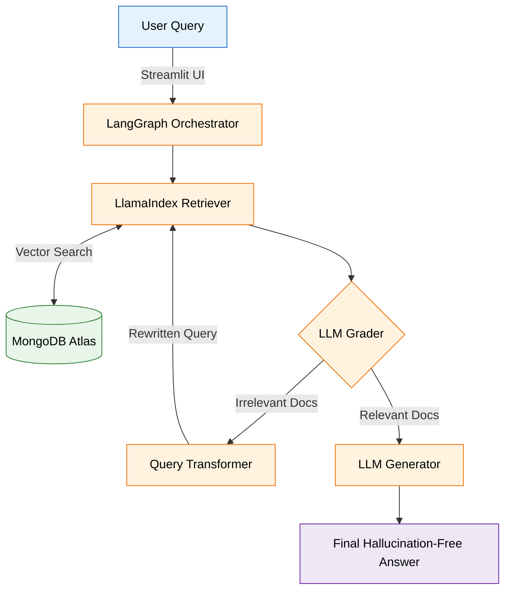

# Corrective Agentic RAG (CRAG) Pipeline

A local, multi-agent Corrective Retrieval-Augmented Generation (CRAG) system built with LangGraph, LlamaIndex, and MongoDB.

This project goes beyond standard linear RAG by implementing a cyclical "*Refinement Subgraph*." If retrieved documents are deemed irrelevant by the LLM Grader, the agent autonomously rewrites the user's query and searches again. It is designed to run highly efficient reasoning loops on constrained hardware (6GB VRAM) while eliminating hallucinations.

## Key Features

- **Agentic Self-Correction**: Utilizes LangGraph to route queries, grade retrieved documents, and autonomously rewrite search queries if the initial context is insufficient.

- **Dual-Purpose MongoDB Integration**: Leverages MongoDB Atlas for high-dimensional Vector Search (semantic retrieval) and as a NoSQL Checkpointer (persisting LangGraph agent state/memory across conversational turns).

- **Custom Data Parsing**: Overrides default LlamaIndex PDF readers with custom `pdfplumber` extractors to preserve the structural integrity of tabular financial data and messy enterprise text.

- **Hardware-Optimized (6GB VRAM)**: Safely runs 4-bit quantized 3B models (`qwen2.5-coder:3b`) concurrently with local embedding models (`nomic-embed-text`) by utilizing precise token-based chunking and hardcoded safety valves to prevent infinite reasoning loops.

- **Interactive Web UI**: Features a sleek, responsive Streamlit frontend that visualizes the agent's "thinking" process and maintains conversational memory.

## Architecture Flow



1. User Query: Entered via the Streamlit UI.

2. Initial Retrieval: LlamaIndex queries MongoDB Atlas for the Top-5 most semantically similar document chunks.

3. Refinement Subgraph (The Loop):

   - Grader Node: The LLM evaluates the relevance of the retrieved chunks against the original query.

   - Query Transformation Node: If chunks are irrelevant, the LLM rewrites the query to be more targeted.

   - Re-Retrieval: The system searches MongoDB again using the new query. (Capped at 3 loops to respect hardware limits).

4. Generation Node: Once relevant context is found (or the loop limit is reached), the LLM synthesizes a strict, hallucination-free answer.

## Tech Stack

- **Orchestration**: LangGraph, LangChain

- **Retrieval & Ingestion**: LlamaIndex, pdfplumber

- **Database & Memory**: MongoDB Atlas (Vector Search)

- **Local Inference**: Ollama (`qwen2.5-coder:3b` for strict rule adherence, `nomic-embed-text` for embeddings)

- **Frontend**: Streamlit

## Project Structure

```
CRAG/
├── agent/
│   ├── graph_parent.py      # Main LangGraph orchestration
│   ├── nodes.py             # LLM logic for retrieval, grading, and generation
│   ├── state.py             # TypedDict schemas for Parent and Subgraph memory
│   └── subgraph_refine.py   # The cyclic evaluation/correction loop
├── core/
│   ├── app.py               # Streamlit Web UI
│   └── main.py              # CLI entry point for testing
├── data/                    # Synthetic Acme Corp PDFs and TXT files for testing
├── database/
│   ├── clean-db.py          # Utility to drop MongoDB collections
│   ├── ingest.py            # LlamaIndex chunking, embedding, and uploading
│   └── setup-db.py          # Programmatic MongoDB Vector Search Index creation
├── .env                     # Environment variables (MongoDB URI)
└── requirements.txt         # Project dependencies
```
## Setup & Installation

### 1. Prerequisites

- Python 3.10+
- `Ollama` installed locally
- A free `MongoDB Atlas` cluster

### 2. Install Dependencices

Clone the repository and install the required Python packages:

```bash
git clone https://github.com/shubhro2002/Corrective-RAG.git
cd Corrective-RAG
pip install -r requirements.txt
```
### 3. Local Model Setup

Ensure Ollama is running, then pull the required models:

```bash
ollama pull nomic-embed-text
ollama pull qwen2.5-coder:3b
```
*(Note: To prevent cyclical load/unload latency on Windows, you can set `OLLAMA_KEEP_ALIVE=-1` in your environment variables).*

### 4. Environment Variables

Create a `.env` file in the root directory and add your MongoDB connection string:

```bash
MONGODB_URI="mongodb+srv://<username>:<password>@cluster0.xxxx.mongodb.net/?retryWrites=true&w=majority"
```
*(Make sure your IP address is whitelisted in the MongoDB Atlas Network Access settings! You can whitelist `0.0.0.0/0` for testing)*

### 5. Initialize Database & Ingest Data

Configure the Vector Search index and upload the dummy data:

```bash
# Creates the necessary search index in MongoDB
python database/setup-db.py

# Parses, chunks, embeds, and uploads the documents in /data
python database/ingest.py
```
## Usage

Launch the Interactive Web UI:

```bash
streamlit run core/app.py
```

Run the Headless CLI Version: (Useful for quick terminal testing or debugging LLM output)

```bash
python core/main.py
```

### Example Test Queries

Try these queries in the UI to watch the agentic routing and memory in action:

- "Who is the lead for Project Phoenix and what is the budget?" (Direct retrieval)

- "I am trying to integrate the Quantum Anvil API but I keep getting error code ERR-77X." (Contextual troubleshooting)

- "Who is the CEO of Microsoft?" (Tests the Grader rejecting irrelevant data and bypassing hallucinations).

## Database Utilities

If you want to clear out the dummy data and test the pipeline on your own PDFs or text files, use the provided cleanup script:

```bash
# Wipes all chunks from the MongoDB vector store
python database/clean-db.py
```

After clearing, drop your new files into the `/data` folder and run `python database/ingest.py` again.