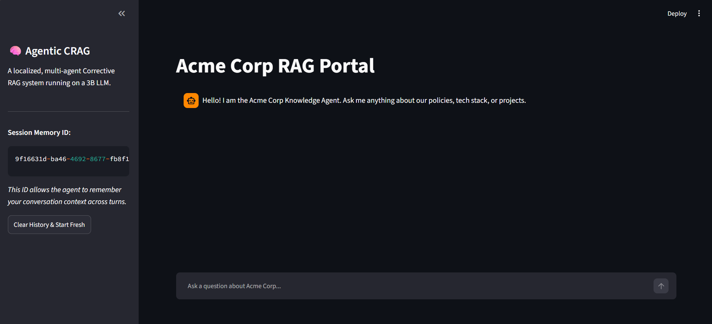
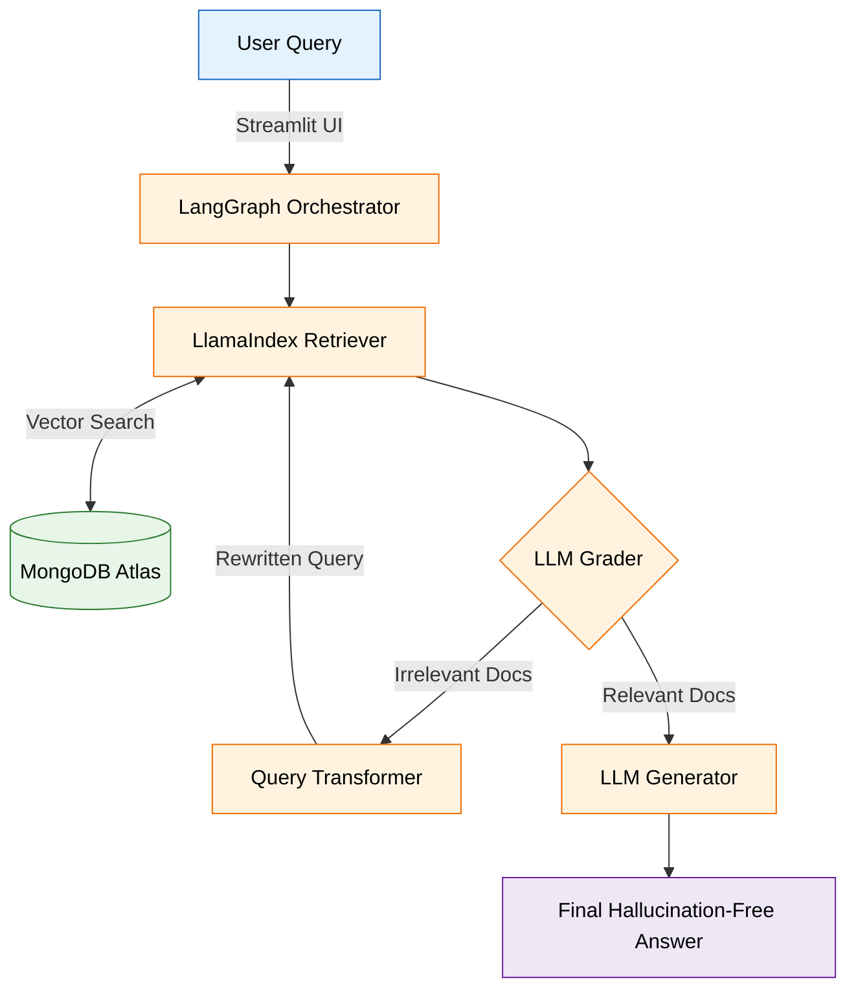
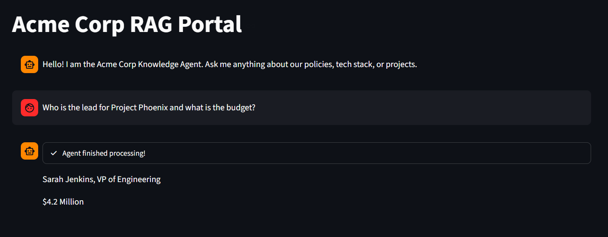
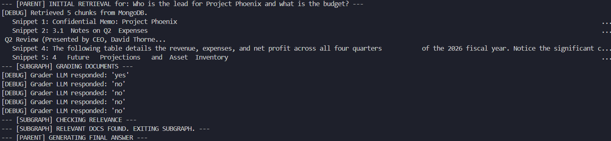
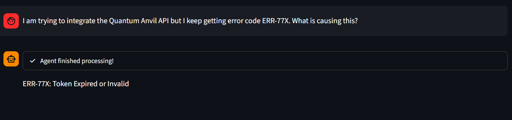
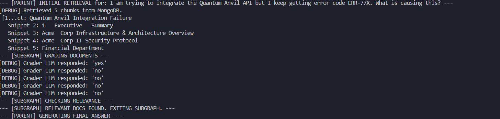
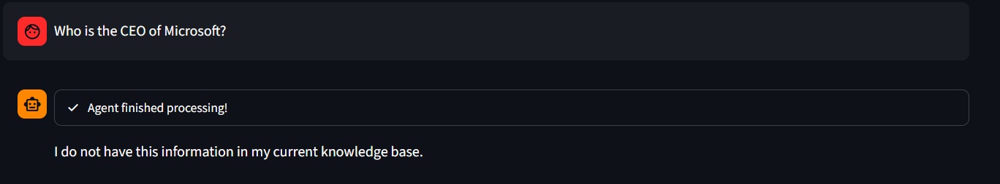
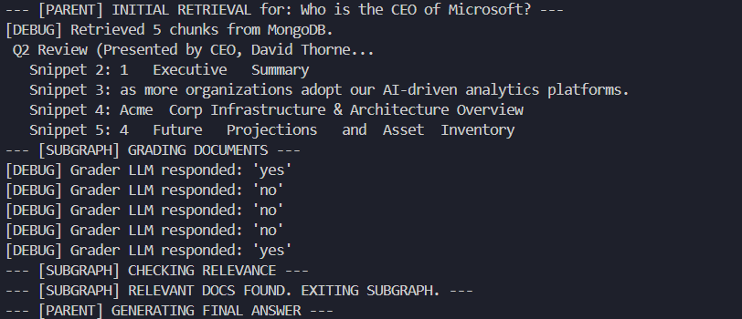

# Corrective Agentic RAG (CRAG) Pipeline

A production-grade, multi-agent Corrective Retrieval-Augmented Generation (CRAG) system built with LangGraph, LlamaIndex, and MongoDB, heavily instrumented for full LLMOps observability.

This project goes beyond standard linear RAG by implementing a cyclical "*Refinement Subgraph*." If retrieved documents are deemed irrelevant by the LLM Grader, the agent autonomously rewrites the user's query and searches again. It leverages cloud-based APIs for high-speed inference and embeddings, backed by rigorous telemetry and continuous automated evaluation.

## Key Features

- **Agentic Self-Correction**: Utilizes LangGraph to route queries, grade retrieved documents, and autonomously rewrite search queries if the initial context is insufficient.

- **LLMOps & Observability**: Fully instrumented with OpenTelemetry and Arize Phoenix. Captures LLM spans, retrieval metrics, and tool execution traces in real-time. Includes automated evaluation scripts to grade document relevance (NDCG/Precision) and response faithfulness.

- **MongoDB Integration**: Leverages MongoDB Atlas for 1536-dimensional Vector Search (semantic retrieval) and as a NoSQL Checkpointer (persisting LangGraph agent state/memory across conversational turns).

- **Cloud-Scaled Inference**: Utilizes the OpenRouter API to seamlessly route requests to frontier models (`gpt-4o-mini` for reasoning, `text-embedding-3-small` for embeddings), ensuring high-speed, scalable performance.

- **Custom Data Parsing**: Overrides default LlamaIndex PDF readers with custom `pdfplumber` extractors to preserve the structural integrity of tabular financial data and messy enterprise text.

- **Interactive Web UI**: Features a sleek, responsive Streamlit frontend that visualizes the agent's "thinking" process and maintains conversational memory.



## Architecture Flow



1. **User Query**: Entered via the Streamlit UI.

2. **Initial Retrieval**: LlamaIndex queries MongoDB Atlas for the Top-5 most semantically similar document chunks.

3. **Refinement Subgraph** (The Loop):

   - **Grader Node**: The LLM evaluates the relevance of the retrieved chunks against the original query.

   - **Query Transformation Node**: If chunks are irrelevant, the LLM rewrites the query to be more targeted.

   - **Re-Retrieval**: The system searches MongoDB again using the new query. (Capped at 3 loops to respect hardware limits).

4. **Generation Node**: Utilizing strict `SystemMessage` / `HumanMessage` role-prompting, the LLM synthesizes a strict, hallucination-free answer.

5. **Observability**: OpenTelemetry silently captures all spans, latency, token usage, and retrieval payloads, pushing them to a local Arize Phoenix dashboard.

## Tech Stack

- **Orchestration**: LangGraph, LangChain

- **Retrieval & Ingestion**: LlamaIndex, pdfplumber

- **Database & Memory**: MongoDB Atlas (Vector Search)

- **LLMs & Embeddings**: OpenRouter API (`gpt-4o-mini`, `text-embedding-3-small`)

- **LLMOps & Telemetry**: Arize Phoenix, OpenTelemetry (`openinference-instrumentation`)

- **Frontend**: Streamlit

## Project Structure

```
CRAG/
├── agent/
│   ├── graph_parent.py      # Main LangGraph orchestration
│   ├── nodes.py             # LLM logic for retrieval, grading, and generation
│   ├── state.py             # TypedDict schemas for Parent and Subgraph memory
│   └── subgraph_refine.py   # The cyclic evaluation/correction loop
├── core/
│   ├── app.py               # Streamlit Web UI
│   ├── eval.py              # Automated LLM-as-a-Judge evaluation script
│   └── main.py              # CLI entry point for testing
├── data/                    # Synthetic Acme Corp PDFs and TXT files for testing
├── database/
│   ├── clean-db.py          # Utility to drop MongoDB collections
│   ├── ingest.py            # LlamaIndex chunking, embedding, and uploading
│   └── setup-db.py          # Programmatic MongoDB Vector Search Index creation
├── .env                     # Environment variables (MongoDB URI, OpenRouter API Key)
└── requirements.txt         # Project dependencies
```
## Setup & Installation

### 1. Prerequisites

- Python 3.10+
- An `OpenRouter` account and API Key
- A free `MongoDB Atlas` cluster

### 2. Install Dependencices

Clone the repository and install the required Python packages:

```bash
git clone https://github.com/shubhro2002/Corrective-RAG.git
cd Corrective-RAG
pip install -r requirements.txt
```

### 3. Environment Variables

Create a `.env` file in the root directory and add your MongoDB connection string and OpenRouter API key:

```bash
MONGODB_URI="mongodb+srv://<username>:<password>@cluster0.xxxx.mongodb.net/?retryWrites=true&w=majority"
OPENROUTER_API_KEY="<your_openrouter_api_key>"
```
*(Make sure your IP address is whitelisted in the MongoDB Atlas Network Access settings! You can whitelist `0.0.0.0/0` for testing)*

### 4. Initialize Database & Ingest Data

Configure the Vector Search index and upload the dummy data:

```bash
# Creates the necessary search index in MongoDB
python database/setup-db.py

# Parses, chunks, embeds, and uploads the documents in /data
python database/ingest.py
```

## The "Acme Corp" Dataset (Dummy Data)

To properly demonstrate the self-correcting logic of this pipeline, the /data folder comes pre-loaded with synthetic documents belonging to "Acme Corp", a fictional enterprise.

This dataset was intentionally designed with specific "trap" questions and edge cases in mind, including:

- **Strict IT Policies & HR Rules**: To test if the LLM's safety alignments interfere with internal corporate data extraction.

- **Financial Reports & Project Budgets**: To test multi-fact reasoning and tabular data extraction.

- **Customer Support Logs & Meeting Minutes**: To test how well the embedding models handle messy, conversational text formats.

## Usage

1. Start the Phoenix Observability Server

Before launching the app, start the Phoenix server in a separate terminal to catch the telemetry data:

```bash
python -m phoenix.server.main serve
```

Access the dashboard at `http://localhost:6006`

2. Launch the Interactive Web UI

In your main terminal, start the Streamlit application:

```bash
streamlit run core/app.py
```
3. Run Continuous Evaluation (LLMOps)

After interacting with the Streamlit app, run the evaluation script. This will download the recent traces from Phoenix, use an LLM-as-a-Judge to score the pipeline's performance, and upload badges (e.g., relevance, faithfulness) directly to your UI dashboard:

```bash
python core/eval.py
```

### Example Test Queries

Try these queries in the UI to watch the agentic routing and memory in action:

- "Who is the lead for Project Phoenix and what is the budget?" (Direct retrieval)





- "I am trying to integrate the Quantum Anvil API but I keep getting error code ERR-77X. What is causing this?" (Contextual troubleshooting)





- "Who is the CEO of Microsoft?" (Tests the Grader rejecting irrelevant data and bypassing hallucinations).





## Database Utilities

If you want to clear out the dummy data and test the pipeline on your own PDFs or text files, use the provided cleanup script:

```bash
# Wipes all chunks from the MongoDB vector store
python database/clean-db.py
```

After clearing, drop your new files into the `/data` folder and run `python database/ingest.py` again.